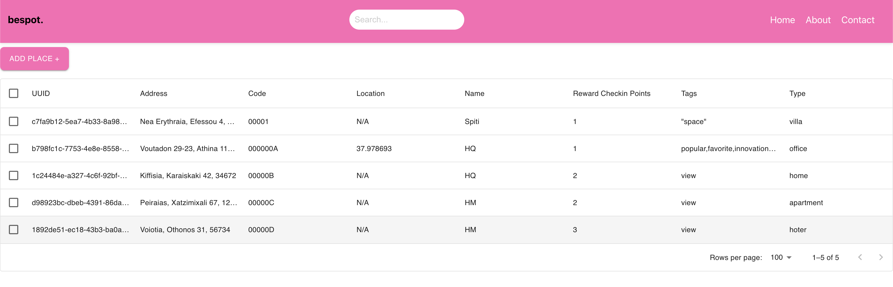

# Bespot Technical Assignment


## Table of Contents

- [Bespot Technical Assignment](#bespot-technical-assignment)
  - [Table of Contents](#table-of-contents)
  - [Introduction](#introduction)
  - [Prerequisites](#prerequisites)
  - [Software Stack](#software-stack)
  - [API Documentation](#api-documentation)
  - [Web Interface](#web-interface)
  - [Installation and Setup](#installation-and-setup)
    - [1. Clone the Repository](#1-clone-the-repository)
    - [2. Build and Start](#2-build-and-start)
  - [Run Tests](#run-tests)
  - [CI/CD](#ci/cd)
  - [Final thoughts](#final-thoughts)


## Introduction

Welcome to the documentation for the `bespot_assesement` project. This document provides step-by-step instructions on how to set up and run the project using Docker and Docker Compose. `bespot_assesement` is a Django-based application for managing places.

## Prerequisites

Before you begin, make sure you have the following prerequisites installed on your system:

- Docker: [Install Docker](https://docs.docker.com/get-docker/)
- Docker Compose: [Install Docker Compose](https://docs.docker.com/compose/install/)

## Software Stack

The software stack for this application is composed of various services defined in the local.yaml configuration file. The backend of the application is implemented using Django Rest Framework. To store and manage data, PostgreSQL has been chosen.

Redis serves a dual role within the application. First, it functions as a caching mechanism, improving performance by storing frequently accessed data and reducing the need for repetitive database queries. Second, Redis serves as a message broker for Celery. While Celery may not perform specific tasks within this project, it is included to demonstrate its capabilities and potential use for background processing in future developments.

As an additional component, Flower, a web-based monitoring tool for Celery, has been integrated into the stack. Flower provides a graphical user interface (GUI) for monitoring and managing Celery tasks, offering insights into task execution and system performance.

Finally, for the front-end, React Framework is used as GUI to perform CRUID operations in the Place model.

## API Documentation

The API documentation for the `bespot_assessement` project is available at the following URL:

```bash
http://localhost:8000/swagger/
```

## Web Interface
The web application is provided through the Django Admin Panel. A user can perform CRUID operations in Place models. Also he can perform search, filtering and sorting by address, name, and uuid.

A superuser is created on the initialization phase. It is available in the following URL:

```bash
http://localhost:8000/admin/ (username: admin@admin.com, password: admin)
```

Additionally, just for demonstration purposes of the Phase 3, a user can list and create places through a React Web Application.

The React Application is available in the following url.

```bash
http://localhost:8000/3000/ (username: admin@admin.com, password: admin)
```

A user may also sort and search for Places depending on their names and codes.



## Installation and Setup

### 1. Clone the Repository

Clone the `bespot_assesement` repository to your local machine:

```bash
git clone https://github.com/GaSkouras/bespot_assesment.git
cd bespot_assesment
```

### 2. Build and Start

The entire stack can be run with the above command. More options can be found in Makefile

```bash
make build
```

## Run Tests

Unittests are implemented with the Python's unittest framework and are executed with pytest. Coverage is used to monitor the overall test coverage of the source code.

```bash
make test
```

## CI/CD

Github Actions is used as a CI/CD of the project. Currently it does only run linting and security check on the code with pre-commit tool and runs the unittests of the back-end application with pytest.

## Final thoughts

In summary, my approach in this project was to leverage the existing capabilities offered by Django Rest Framework (DRF) to streamline the development process. The utilization of the Viewset Class allowed for the effortless implementation of Create, Read, Update, Delete (CRUD) operations for the Places model. The primary additional code required pertained to the implementation of a caching mechanism. Similarly, the validation aspect was simplified, thanks to DRF's inherent features.

I designed the Location model to store precise geographic coordinates (latitude and longitude) separately, making it easier to handle location data. The Place model combines essential place details and offers flexibility by allowing optional fields like name and reward points, ensuring it can accommodate various types of places with diverse attributes. A potential enhancement could involve creating a separate Tag model with predefined choices. This would allow for a structured and standardized approach to categorizing places, making it easier to manage and filter places based on specific predefined tags, improving the organization and usability of the application.

Furthermore, I adopted a centralized and uniform approach to error handling, ensuring consistency throughout the project. This strategy significantly reduced the need for extensive unit testing, as DRF already provides robust testing for its core functionality.

To enhance the user experience, I harnessed the built-in Django Admin Panel, effectively transforming it into a web application capable of facilitating CRUD operations. This approach further reduced the testing workload, as both Django and DRF have already undergone extensive testing.

As for Phase 3 of the project, I introduced a basic front-end component to showcase the microservice architecture. It is important to note that this front-end does not provide full functionality, as its primary purpose was to demonstrate the architectural concept.
